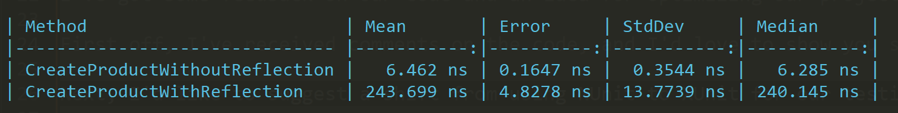

## Performance Comparison

Take a look at the performance comparison below:

- `CreateProductWithReflection` took 243.699 ns
- `CreateProductWithoutReflection` took only 6.462 ns

### Note on Reflection

While `CreateProductWithReflection` may be useful in certain scenarios, it's important to be mindful of its performance implications. Reflection can be significantly slower compared to other techniques. Whenever possible, consider alternatives that don't rely on reflection to achieve better performance.

Please review your code and use reflection judiciously to ensure optimal performance.
